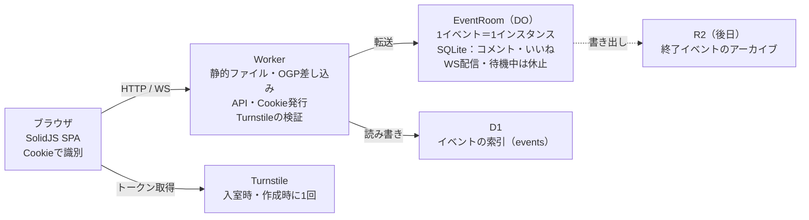

# アーキテクチャ

1 つの Worker が画面と API を配信し、イベントへの書き込みはそのイベント専用の Durable Object「EventRoom」に集める。書き込みが 1 か所で順番に処理されるので、いいねや編集の競合が仕組み上起きない。

## 構成

| 要素 | 役割 |
| --- | --- |
| Worker（静的アセット付き） | SPA の配信、`/e/:id` への OGP 差し込み（HTMLRewriter）、API、Cookie の発行と検証、Turnstile の検証 |
| EventRoom（Durable Object、SQLite） | イベントの全データ。WebSocket の受付と配信（Hibernation API）、連投上限、削除後の掃除アラーム |
| D1 | イベントの索引。OGP 生成や ID の存在確認で、EventRoom を起こさずに済む読み取りを担う |
| Turnstile | イベントページを開いたときと作成時に 1 回だけ |
| R2（後日） | 終了イベントの JSON アーカイブ |

開発環境は Wrangler と Vite（Cloudflare Vite プラグイン）で、DO・D1 も含めてローカルで動かす。デプロイは GitHub Actions から行い、PR ごとにプレビューを出す現行の運用を引き継ぐ。

## データモデル

イベントの中身はすべてその EventRoom 内の SQLite に置き、D1 には全体の索引だけを置く。削除時はその DO をまるごと消せばコメントも残らない。

### D1（グローバル）

| テーブル | 主な列 | 用途 |
| --- | --- | --- |
| `events` | `id`（nanoid 8 文字）, `name`, `date`, `created_at`, `deleted_at` | OGP 生成、ID の存在確認、削除済みの掃除 |

イベント一覧や検索の画面は持たないので、D1 はこの 1 表で足りる。将来の集計や掃除のために残す。

イベント名・開催日を変更したときは、EventRoom が D1 の `events` も更新する（OGP を最新に保つため）。

### EventRoom 内の SQLite（1 イベント = 1 インスタンス）

| テーブル | 主な列 | 備考 |
| --- | --- | --- |
| `event` | `name`, `date`, `url`, `hashtag`, `comments_open`, `live_talk_id`, `deleted_at` | 1 行のみ |
| `talks` | `id`, `position`, `speaker`, `title` | `position` で並べ替え |
| `comments` | `id`, `talk_id`, `author_id`, `body`, `kind`, `hidden`, `created_at` | `kind` は将来の質問区別用、当面は `comment` 固定 |
| `likes` | `comment_id`, `voter_id`, `created_at` | 主キーを `(comment_id, voter_id)` にして二重いいねを防ぐ |
| `admin_keys` | `id`, `role`（owner / manager）, `token_hash`, `created_at`, `revoked_at` | owner は 1 件、manager は複数 |
| `hidden_authors` | `author_id`, `created_at` | 一括非表示した投稿者。以降の投稿も非表示にする |
| `author_keys` | `author_id`, `key`, `created_at` | 管理画面で投稿者を表すキー（乱数）。参加者 ID は管理者にも見せない |

- 非表示は削除ではなくフラグにし、管理画面から「表示に戻す」ができるようにする
- 発表枠を削除したときは、その発表のコメントといいねも同じトランザクションで消す
- イベント削除は `deleted_at` を入れる論理削除とし、7 日後に DO のアラームで全データを消す。D1 の `events` も削除時に `deleted_at` を入れ、掃除のときに行ごと消す
- 復元の日数は `LIMIT_DELETED_RETENTION_DAYS` で変えられる

## HTTP API

参加者の操作（投稿・いいね・削除）は WebSocket で送り、管理操作は HTTP で送る。どちらも最終的に EventRoom が処理し、結果を全接続に配信する。

| メソッド・パス | 権限 | 内容 |
| --- | --- | --- |
| `GET /`、`GET /new` | 誰でも | SPA の HTML。サービス共通の OGP |
| `GET /e/:id` | 誰でも | SPA の HTML。イベント名入りの OGP を差し込む |
| `GET /api/session` | 誰でも | 有効な参加者 Cookie があるかを返す（ないときは 401）。あれば同じ ID で出し直して有効期限を延ばす |
| `POST /api/session` | 誰でも | Turnstile トークンを検証し、参加者 ID の Cookie を発行。有効な Cookie があれば検証せずそのまま使う |
| `POST /api/events` | 誰でも（Turnstile 必須） | イベント作成。返り値に作成者トークンを一度だけ含める |
| `GET /api/events/:id` | 誰でも | イベント情報と発表枠 |
| `GET /api/events/:id/ws` | 参加者 Cookie | WebSocket への切り替え |
| `POST /api/events/:id/admin/session` | 作成者・共同管理者トークン | トークンを管理セッション Cookie に入れ替える。削除済みのイベントは作成者トークンだけ通す（復元のため） |
| `GET /api/events/:id/admin` | 管理 | 権限・イベント情報・発表枠・発表ごとのコメント数・削除の状態（管理画面の表示と、メニューに「イベントを管理する」を出すかの判定）。削除済みなら作成者にだけ返す |
| `PATCH /api/events/:id` | 管理 | イベント情報の更新（変更した項目だけ）。コメント受付の一時停止（`commentsOpen`）もここで切り替える |
| `POST` / `PATCH` / `DELETE /api/events/:id/talks[/:talkId]` | 管理 | 発表枠の追加・編集・削除。最後の 1 枠は削除できない（409） |
| `PUT /api/events/:id/talks/order` | 管理 | 並び順（今あるすべての ID の配列。過不足があれば 409） |
| `GET /api/events/:id/admin/comments` | 管理 | コメント一覧（非表示も含む、新しい順）。投稿者は `author_keys` のキーで表す |
| `POST /api/events/:id/comments/:cid/hide`（と `unhide`） | 管理 | コメントの非表示・再表示 |
| `POST /api/events/:id/authors/:aid/hide`（と `unhide`） | 管理 | 投稿者単位の一括非表示と、その解除（`:aid` は投稿者のキー）。解除するとその投稿者の非表示のコメントをすべて表示に戻す |
| `GET /api/events/:id/admin-keys` | 作成者 | 共同管理者 URL の一覧（発行日・無効化日時。トークンは含めない） |
| `POST` / `DELETE /api/events/:id/admin-keys[/:keyId]` | 作成者 | 共同管理者 URL の発行・無効化。発行時だけトークンを返す。有効な URL は上限（初期値 20）まで |
| `DELETE /api/events/:id`（と `POST .../restore`） | 作成者 | 論理削除と復元。復元は期限（7 日）内だけで、過ぎていれば 404 |

作成者だけの操作を共同管理者の管理セッションで呼ぶと 403 を返す。

## WebSocket メッセージ

| 向き | 種別 | 内容 |
| --- | --- | --- |
| サーバー→ | `snapshot` | 接続直後に送る。イベント・発表枠・表示中の全コメント・いいね数・自分がいいねしたコメント |
| サーバー→ | `comment.added` / `comment.removed` / `like.changed` | 差分。各メッセージに連番 `seq` を付ける |
| サーバー→ | `comment.accepted` | 再送された投稿が登録済みだったとき、送った本人にだけ返す（`seq` なし） |
| サーバー→ | `error` | `rate_limited` / `comments_closed` / `invalid_message` / `not_found`。投稿への応答なら `clientId`、いいね・削除への応答なら `commentId` を付ける |
| サーバー→ | `event.updated` / `talks.updated` | 管理操作の反映 |
| クライアント→ | `comment.post` | `talkId`, `body`, クライアント生成の `clientId`（二重送信防止・自分の投稿の照合） |
| クライアント→ | `comment.delete` / `like.set` | 自分のコメントの削除、いいねの付け外し |

- 全発表分をまとめて配信し、発表の絞り込みはクライアントで行う。発表を切り替えても通信が起きず、一覧シートの件数表示もそのまま出せる
- 再接続時は接続 URL の `?since=` に最後に受け取った `seq` を付け、それ以降の差分だけを受け取る。EventRoom は差分を直近 1000 件だけ `updates` 表に残し、それより古い・不正な値なら `snapshot` を送る。送り直すときは本文を今の `comments` から組み立て、その間に非表示・削除されたものは送らない
- 自分の投稿には `clientId` を付けて返す（`snapshot` 内も）。クライアントは受け付けの知らせがない投稿を再接続後に送り直し、EventRoom は `(author_id, client_id)` の一意制約で二重登録を防ぐ
- WebSocket Hibernation API を使い、発言がない間は DO を休止させて実行時間の課金を止める
- 死活確認はクライアントが `ping` を送り、`setWebSocketAutoResponse` で DO を起こさずに `pong` を返す
- 非表示にしたコメントは参加者には `comment.removed` として配信し、本文を送らない。表示に戻したコメントは `comment.added` として配信し、クライアントは投稿時刻の位置に差し込む
- 投稿者ごと非表示にした人の投稿は非表示のまま登録し、誰にも配信しない。本人には `comment.accepted` だけを返す（送り直しを止めるため）
- モデレーション操作は HTTP の応答で最新のコメント一覧を返す。管理画面のコメント一覧は WebSocket では更新せず、開いたときと「最新にする」で読み込む
- `like.changed` の `likedByMe` は、いいねを付け外した本人の接続にだけ付ける（他の人の状態は変わらないため）。状態が変わらない `like.set`（いいね済みへのいいね等）は何も配信しない
- 自分のコメントへのいいねは `invalid_message`、他人のコメントの削除は `not_found` で拒否する。自分のコメントの削除は非表示と違い、コメントといいねを実際に消す
- 送り直す差分は 1 件につき必ず 1 通にして `seq` を飛ばさない。その後に非表示・削除されたコメントの差分は `comment.removed` として送る
- `event.updated` / `talks.updated` も `seq` を付けて `updates` 表に残し、送り直すときは送る時点のイベント情報・発表枠を入れる
- 発表枠を削除したときは `talks.updated` だけを送り、クライアントは消えた発表のコメントを取り除く
- イベントを削除したときは、全接続をコード `4404` で閉じる。クライアントは再接続せず「このイベントは削除されました」を出す

## スパム対策・セキュリティ

機械的な攻撃は入室時の Turnstile で止め、人による荒らしは管理者の操作で止める。普通の参加者はどの対策にも気づかないことを条件にする。

| 対策 | 防ぐもの | 設定値（初期値） |
| --- | --- | --- |
| Turnstile（イベントページを開いたときに 1 回、Invisible またはマネージド） | スクリプトによる ID の大量生成・書き込み | — |
| Turnstile（イベント作成時） | イベントの大量作成 | — |
| 緩い連投上限（EventRoom 内、参加者 ID ごと） | 取得した Cookie でのスクリプト暴走 | 10 秒に 20 件 |
| 文字数上限 | 巨大な投稿 | 500 文字 |
| 管理者の非表示・投稿者単位の一括非表示 | 手による荒らし | — |
| コメント受付の一時停止 | 荒らしが続くときの緊急停止 | — |

上限値は環境変数で変えられるようにし、運用しながら調整する。上限に当たったときは、投稿を捨てず「少し待ってから送信してください」と返す。

### その他のセキュリティ

- コメントはプレーンテキストとして扱い、HTML として解釈しない。URL はリンク化するが、開く前に確認を出す
- Cookie は `HttpOnly; Secure; SameSite=Lax`。値は `COOKIE_SECRET` で HMAC-SHA256 署名する。参加者 ID はクライアントに返さない
- 参加者 Cookie の有効期限は 1 年。イベントページを開くたびに同じ ID で出し直して延ばすので、イベントの最中には切れない
- Turnstile は用途ごとに action（`join`・`create_event`）を付け、Worker で一致を確かめる
- 管理操作の HTTP は `Origin` ヘッダーを検証して CSRF を防ぐ
- 管理セッション Cookie（`adm`）はイベント ID と管理キー ID を署名したもので、`Path=/api/events/{id}` に絞る。有効期限は 30 日で、管理画面を開くたびに延ばす。キーが無効化されていないかは EventRoom が操作のたびに確かめる
- WebSocket 接続時も `Origin` を検証する
- トークンの照合は定数時間比較で行う
- CSP を設定し、外部スクリプトは Turnstile など必要なものに限る

## 料金の目安（無料プラン）

Durable Objects は無料プランでも SQLite バックエンドなら使える。上限は 1 日あたりリクエスト 10 万、SQLite の書き込み 10 万行、読み取り 500 万行、ストレージ 5GB。受信した WebSocket メッセージは 20 件で 1 リクエストと数える。50 人・300 コメント程度の LT 会なら十分に収まる見込み。

参考: [Durable Objects Pricing](https://developers.cloudflare.com/durable-objects/platform/pricing)（2026-09 時点）
